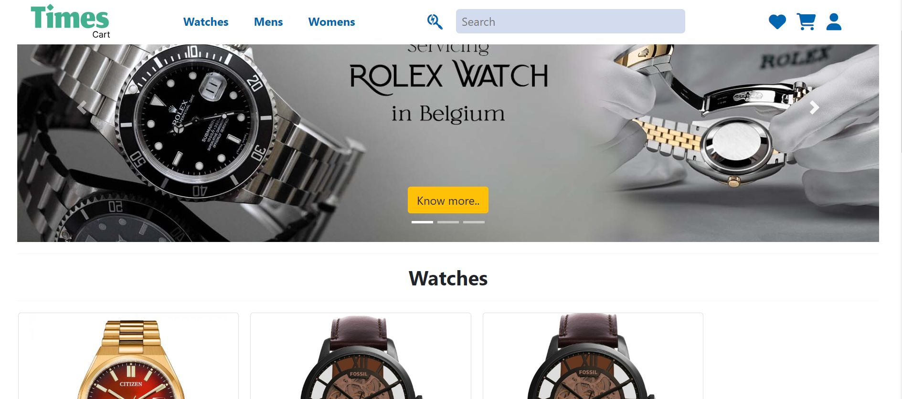
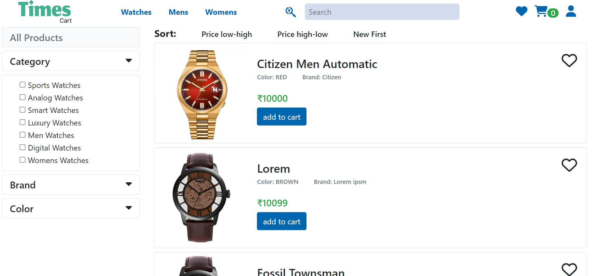

    <picture>
    
    </picture>

    
       
        
        
    
    

<h4 align="center">
    

        <a href="https://ecommerce-fullstack-b3nc.onrender.com/">Deployed URL</a>
    

</h4>
Times Cart is an ecommerce platform specializing in the sale of watches. It offers a range of features aimed at providing a seamless shopping experience for users. Below are the key features implemented in the project:

## Features

- **Secure Authentication:** Utilizes JWT for token-based authentication ensuring secure access to user accounts.
- **User Profile and Account Management:** Users can manage their profiles and accounts conveniently through the platform.
- **Cart and Wishlist Management:** Users can add items to their cart for easy checkout and manage their wishlist for future purchases.
- **Discounts Management:** Added Coupen offer for getting descout for the product.
- **Review and Rating System:** Gather feedback from users through a review and rating system.
- **Order Tracking:** Track the status of orders, with options to return or cancel orders if needed.
- **Payment Interface:** Secure online transactions facilitated through Razorpay, ensuring the safety of user payments.
- **Admin Dashboard:** Manage the ecommerce platform efficiently with an intuitive admin dashboard. Dynamic content rendering with HTML and Handlebars for enhanced usability.
  
## UI demo

    <picture>
    
    </picture>

## Technologies Used

- **Frontend:** HTML, CSS, Handlebars, jquery, Bootstrap
- **Backend:** Express.js, Node.js
- **Database:** MongoDB
- **Payment integration:** Razorpay
 

    <picture>
    
    </picture>

Times cart is successfully hosted on render You can access the live site [ecommerce-fullstack-b3nc.onrender.com](https://ecommerce-fullstack-b3nc.onrender.com/).

## Contributing

If you're interested in contributing to Times Cart, please read the [CONTRIBUTING.md](CONTRIBUTING.md) file for guidelines and instructions.

## License

This project is licensed under the MIT License - see the [LICENSE.md](LICENSE.md) file for details.

